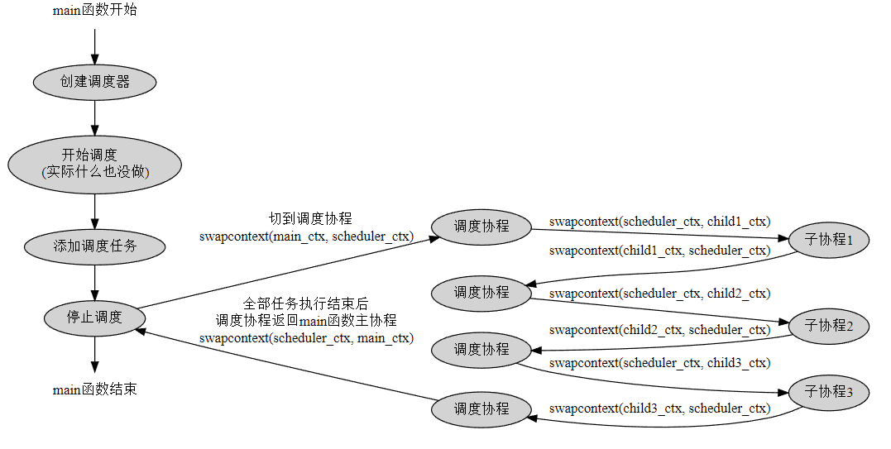

# ultraServer

ultra高性能服务器框架

##当前进度
| 日期         |        进度        |
|------------|:----------------:|
| 2022-9-28  |   创建项目结构，项目初始化   |
| 2022-9-29  |      完成日志模块      |
| 2022-10-5  | 完善util模块与macro模块 |
| 2022-10-8  |     完成环境配置模块     |
| 2022-10-9  |   融合日志模块与配置模块    |
| 2022-10-12 |      完成线程模块      |
| 2022-10-17 |      完成协程模块      |
| 2022-10-19 |     完成协程调度模块     |
| 2022-10-25 |     完成IO调度模块     |
| 2022-10-31 |     完成定时器模块      |
| 2022-11-2  |      hook模块      |
| 2022-11-4  |    address模块     |


## 模块概述

### 日志模块

支持流式日志风格写日志和格式化风格写日志，支持日志格式自定义，日志级别，多日志分离等功能。

流式日志使用示例：

```cpp
ULTRA_LOG_INFO(g_logger) << "message";
```

c风格格式化日志使用示例：
```cpp
ULTAR_LOG_FMT_INTO(g_logger,"%s","this is a log");
```
### 配置模块
用于定义、声明配置项，并且从配置文件中加载用户配置。

#### 配置模块设计
简单来说，约定优于配置的背景条件是，一般来说，程序所依赖的配置项都有一个公认的默认值，也就是所谓的约定。这点有可许多可以参考的例子，比如对于一个http网络服务器，服务端口通常都是80端口，对于配置文件夹路径，一般都是conf文件夹，对于数据库目录，一般都是db或data文件夹。对于这些具有公认约定的配置，就不需要麻烦程序员在程序跑起来后再一项一项地指定了，而是可以初始时就将配置项设置成对应的值。这样，程序员就可以只修改那些约定之外的配置项，然后以最小的代价让程序跑起来。

约定优于配置的方式可以减少程序员做决定的数量，获得简单的好处，同时兼顾灵活性。

在代码上，约定优于配置的思路体现为所有的配置项在定义时都带一个的默认值，以下是一个ultra配置项的示例，这是一个int类型的配置项，名称为tcp.connect.timeout，初始值为5000。

```cpp
static ultra::ConfigVar<int>::ptr g_tcp_connect_timeout = ultra::Config::Lookup("tcp.connect.timeout", 5000, "tcp connect timeout");
```

ultra的配置项定义之后即可使用，比如上面的配置项可以直接使用g_tcp_connect_timeout->getValue()获取参数的值，这里获取的为默认值5000。

ultra使用YAML做为配置文件，配置名称大小写不敏感，并且支持级别格式的数据类型，比如上面的配置项对应的YAML配置文件内容如下：

```yaml
tcp:
    connect:
        timeout: 10000
```

这里指定了配置名称为 tcp.connect.timeout的配置项的值为10000。由于配置文件指定的值与默认值不一样，当配置文件加载后，对应的配置项值会被自动更新为10000，如果配置项还注册了配置变更回调函数的话，会一并调用配置变更回调函数以通知配置使用方。

ultra支持STL容器（vector, list, set, map等等），支持自定义类型（需要实现序列化和反序列化方法)。

#### 配置模块实现

使用YAML解析库，核心技术使用仿函数的偏特化实现。

### 协程模块
1. **协程与函数**：协程其实就是函数，它不能像线程一样并发，工作在用户态。协程与函数的不同点就是函数一旦被调用，只能从头开始执行，直到函数结束，而协程
可以执行到一半就退出（也就是协程的原语yield）,但这个时候协程并没有真正得结束，只是让出CPU执行权，在后面合适的时机再
重新恢复运行（也就是协程的resume方法），在这段时间内，其他的协程可以获得CPU执行权，所以协程也称为轻量级线程（减少了很多上下文切换）。
2. **协程可实现的基础**：协程能够之所以执行过程中能够yield，是因为能够保存yield之前的状态，以便后面再恢复执行，这个状态也就是协程上下文。协程上下文包含了函数在当前执行状态下得全部CPU寄存器的值，这些寄存器值记录了函数栈帧、代码的执行位置等信息，如果将这些寄存器的值重新设置给CPU，就相当于恢复了函数的运行。在linux下用ucontect_t结构体表示，通过getcontext()来获取。
3. **协程与线程**：协程虽然称为轻量级线程，但是单线程内协程是不能并发的，其本质还是函数，只不过可以花里胡哨的运行，协程只能一个协程yield后另外一个协程resume，而线程是真正可以实现并发执行的。
4. **注意**：因为单线程下协程不是并发执行的，所以不能在协程里使用线程级别的锁来做协程同步。


####协程模块设计
采用非对称协程模型设计，也就是子协程只能和线程主协程切换，而不能和另外一个子协程切换，并且在程序结束时，一定要再切回主协程，以保证程序正确结束。

对称协程中，子协程可以直接和子协程切换，也就是说每个协程不仅要运行自己的入口函数代码，还要负责选择出下一个合适的协程进行切换，每个协程都要充当调度器的角色，这样设计程序的控制流会变得很复杂和难以管理。而在非对称协程中，可以借助专门的调度器来负责调度协程，每个协程只需要运行自己的入口函数，然后结束时将运行权交给调度器，由调度器选出下一个要执行的协程即可。

借助线程局部变量thread_local来实现协程模块：
* thread_local: 线程局部变量与全局变量类似，不同之处在于声明的线程局部变量在每个线程都独有一份，而全局变量是全部线程共享一份。

使用线程局部变量来保存协程上下文对象，是为了在不同线程的协程相互不影响，每个线程都要独自处理当前线程的协程切换问题。使用两个线程局部变量来存储上下文信息分别是t_fiber,和t_thread_fiber，也就是说一个线程在任何时候最多只知道这两个协程的上下文信息。两个协程通过swapcontext函数来实现切换，也就是说，这两个线程局部变量必须有一个是来保存线程主协程的上下文的，如果两个线程局部变量都是保存子协程的上下文，那么无论怎么调用swapcontext，都无法切换到线程主协程，程序就跑飞了。
### 协程调度模块
实现N-M的协程调度器，N个线程运行M个协程，协程可以在线程之间进行切换，也可以绑定到指定的线程运行。协程调度实现了子协程与子协程之间的切换。

#### 协程调度概述

当有很多协程时，怎么用线程把这些协程都消化掉，这就是协程调度。之前的协程模块，需要用户手动执行resume方法进行调度，等协程运行结束返回，再运行下一个协程。用户在充当调度器，使用不够方便。引入协程调度后，创建一个协程调度器，然后将协程或者函数加入调度器，由调度器来完成调度工作，其实就是协程池。

#### 协程调度设计

使用多线程消化添加到任务队列的协程和线程。

1. 协程调度的初始化。协程调度器在初始化时支持传入线程数和一个布偶型的use_caller参数，此参数表示是否使用caller线程。在使用caller线程的情况下，线程数自动减一，并且调度器内部会初始化一个属于caller线程的调度协程并保存起来。
2. 添加任务。通过schedule方法向调度器中添加任务，但此时调度器不会立马工作，而是将他们保存到任务队列中。
3. 启动调度。对应start方法，此方法会创建线程池，线程数由初始化参数决定，调度线程一旦创建完成后，就会从任务队列中取任务执行。
4. 调度协程。对应run方法。调度协程负责从调度器的任务队列中取任务执行。取出的任务即子协程，调度协程与子协程之间切换即为前面说的非对称模型，每个子协程执行完都必须切换到调度协程，当任务队列为空的时候，切换到idle(空闲)协程，这个idle什么也不做，等有新任务添加后，idle会退出并回到调度协程，继续调度任务。

    在非对称协程中，子协程只能与主协程切换。调度协程不能直接和子线程切换，主要原因就是每个线程用两个线程局部变量只保存了正在运行的协程的上下文，以及线程主协程的上下文，如果是保存两个子协程的上下文，就无法切换回主协程，导致程序跑飞。改用三个线程局部变量即可实现调度协程与子协程切换，三个线程局部变量分别保存正在运行子协程的上下文，线程主协程上下文，调度协程上下文。
    1. 给协程类增加一个bool类型的成员m_runInScheduler，用于记录该协程是否通过调度器来运行。

    2. 创建协程时，根据协程的身份指定对应的协程类型，具体来说，只有想让调度器调度的协程的m_runInScheduler值为true，线程主协程和线程调度协程的m_runInScheduler都为false。

    3. resume一个协程时，如果如果这个协程的m_runInScheduler值为true，表示这个协程参与调度器调度，那它应该和三个线程局部变量中的调度协程上下文进行切换，同理，在协程yield时，也应该恢复调度协程的上下文，表示从子协程切换回调度协程；

    4. 如果协程的m_runInScheduler值为false，表示这个协程不参与调度器调度，那么在resume协程时，直接和线程主协程切换就可以了，yield也一样，应该恢复线程主协程的上下文。m_runInScheduler值为false的协程上下文切换完全和调度协程无关，可以脱离调度器使用。

    经过上面的改造了，就可以解决单线程环境下caller线程主协程-调度协程-任务协程之间的上下文切换问题了，假设caller线程主协程的上下文为main_ctx，调度协程的上下文为scheduler_ctx，任务协程上下文为child_ctx，那么单线程下的协程切换将像下面这样：
    

### IO协程调度——epoll

继承自协程调度模块。封装了epoll，支持为socket fd注册读写事件回调函数。IO调度模块重写idle方法解决协程调度模块idle协程忙等待cpu占用率高的问题。IO协程调度器使用一对管道pipe来tickle调度协程，当调度器空闲时，idle协程通过epoll_wait阻塞在读管道的fd上，等到管道的读事件发生，也就意味着有新任务需要调度(tickle方法写管道)，idle协程检测到管道可读后退出，调度器执行执行调度。

#### IO协程调度概述

前面的协程调度模块中，调度器对协程的调度是无条件执行的，在调度器启动的情况下，任务一旦添加成功，就会排队等待调度器执行。调度器不支持删除调度任务，并且在调度器退出之前一定会执行完全部任务，所以可以这样认为，一旦将一个协程加入调度器任务队列，就相当于调用了协程的resume方法。

IO协程调度支持协程调度的全部功能，毕竟是继承自协程调度。除了协程调度，IO协程调度添加了IO事件调度的功能，这个功能是针对文件描述符的。IO协程调度支持为描述符注册可读可写事件的回调函数，当描述符可读或可写时，执行对应的回调函数，这个回调函数相当于协程。

IO协程调度将开发者从判断socket fd是否可读可写的工作中解法出来，只需要关注socket fd的IO操作。


#### IO调度协程设计

IO协程调度模块基于epoll实现，只支持Linux平台。对于每个fd，支持两种事件，一类是可读事件，对应EPOLLIN,一类是可写事件，对应EPOLLOUT。

epoll不止支持了这两种事件，还有比如EPOLLRDHUP、EPOLLERR、EPOLLHUP等，对于这些事件，都将他们分别对应加入EPOLLIN和EPOLLOUT，也就是说所有事件都可以表示为可读可写事件。

对于IO调度协程来说，每次调度都包含一个三元组信息，分别是文件描述符——事件类型（可读、可写）——回调函数，调度器记录全部需要调度的三元组信息，其中描述符和事件类型用于epoll_wait，回调函数用于协程调度。这个三元组源码中用FdContext结构体表示，在执行epoll_wait时，通过epoll_event的私有数据指针event.data.ptr来保存FdContext结构体信息。

IO协程调度器重写的idle方法，会epoll_wait所有已注册的fd，epoll_wait检测到有事件发生后返回，遍历发生的事件，从event.data.ptr中拿到FdContext信息，并执行其中的回调函数。（实际上idle协程只负责收集所有已触发的fd的回调函数，并将其加入调度器的任务队列，真正执行的时机是idle协程退出后）

与协程调度器不一样的是，IO协程调度支持取消事件，表示不对这个fd关心了，如果某个fd的可读可写事件都被取消了，那么这个fd会从调度器的epoll_wait中删除。

#### 总结

1. IO协程调度模块，一方面是对协程调度模块的改造，重写了tickle和idle函数。另一方面是基于epoll实现IO事件的添加、删除、调度、取消等功能
2. IO协程调度关注的是FdContext信息，也就是描述符-事件-回调函数三元组，IOManager需要保存所有关注的三元组，并且在epoll_wait检测到描述符事件就绪时执行对应的回调函数。
3. epoll是线程安全的，即使调度器有多个调度线程，它们也可以共用同一个epoll实例，而不用担心互斥。由于空闲时所有线程都阻塞的epoll_wait上，所以也不用担心CPU占用问题。
4. IO多路复用应该搭配非阻塞IO使用，原因：
   1. 当新数据到达描述符，select返回描述符可读，但Linux内核协议栈检查到新数据包的校验和错误，故丢弃该数据，采用阻塞式IO去读该套接口，无数据可读，则当前进程阻塞。
   2. 惊群现象：当采用多线程方式通过select或epoll监听套接字，当新连接到达，则所有监听套接字的线程会通过select被唤醒，但是最终只有一个线程会通过accept与这个新连接建立握手关系，如果采用了阻塞式IO，则其余所有没有接收到accept连接的线程会阻塞。

### 定时器模块

基于epoll_wait超时实现定时器功能，精度毫秒级，支持在超时时间结束之后执行回调函数。

#### 定时器概述

通过定时器可以给服务器注册定时事件，这是服务器上经常需要使用的功能，比如3秒后关闭一个连接，或者定期检测一个客户端的连接状态。

服务器通常需要处理众多定时事件，如何将这些事件有效的组织和管理十分重要。我们需要使用某种数据结构，来对定时器进行统一管理。

每个定时器通常至少有两个成员: 一个超时时间和一个超时后的回调函数。

有两种高效的管理定时器的方式：时间轮、最小堆。

#### 定时器设计

采用最小堆设计，所有的定时器根据绝对的超时时间排序，每次取出离当前时间最近的一个超时时间点，计算出超时需要等待的时间，传给epoll_wait，等待其返回。超时时间到后，获取当前的绝对时间点，然后把最小堆里超时时间小于这个时间点的定时器都收集起来，执行他们的回调函数。

在注册定时事件时，传入的时间是相对时间，需要转化为绝对时间进行排序。

定时器超时等待基于epoll_wait，精度只支持毫秒级。

定时器与IO协程调度的整合：之前IO协程调度模块的idle协程会在调度器空闲时阻塞在epoll_wait上，等待IO事件发生，之前epoll_wait有固定的超时时间，5s。加入定时器后，epoll_wait的超时时间改为当前定时器的最小超时时间来代替。最小时间超时后，根据当前的绝对时间把已经超时的定时器收集起来，执行他们的回调函数。

由于epoll_wait的返回不一定是因为超时引起的，也有可能是IO事件唤醒的，所以在epoll_wait返回后不能想当然以为是超时时间到了，需要判断一下定时器有没有超时，这时候绝对时间的好处就体现出来了，通过比较当前的绝对时间和定时器的绝对超时时间，就可以确定一个定时器到底有没有超时。

### HOOK模块——同步方式实现异步

hook系统底层和socket相关的API，socket IO相关的API，以及sleep系列的API。hook的开启控制是线程粒度的，通过hook模块，可以使一些不具备异步功能的API，实现异步。mysql查询时使用异步可用。

#### hook概述

hook实际上就是对系统调用API进行一次封装，将其封装成一个与原始调用API同名的接口，应用在调用这个接口时，会先执行封装中的操作，再执行原始系统调用API。

hook技术可以使应用程序在执行系统调用之前进行一些隐藏的操作，比如对malloc()与free()进行hook，在真正进行内存分配和释放之前，统计内存的引用计数，以便排查内存泄漏问题。

##### hook功能

hook是为了在不重新编写代码的时候，把原先代码中socket IO相关的API都转成异步，以提高性能。hook与IO协程调度密切相关的。考虑IOManager要在一个线程上按顺序调度以下协程：
1. 协程1：sleep(2)睡眠两秒后返回。
2. 协程2：在socket fd1上send 100k数据
3. 协程3：在socket fd2上recv直到数据接收成功

在未hook的情况下，IOManager要调度上面的协程，流程是下面这样的：

1. 调度协程1，协程阻塞在sleep上，等2秒后返回，这两秒内调度线程是被协程1占用的，其他协程无法在当前线程上调度。 
2. 调度协徎2，协程阻塞send 100k数据上，这个操作一般问题不大，因为send数据无论如何都要占用时间，但如果fd迟迟不可写，那send会阻塞直到套接字可写，同样，在阻塞期间，其他协程也无法在当前线程上调度。 
3. 调度协程3，协程阻塞在recv上，这个操作要直到recv超时或是有数据时才返回，期间调度器也无法调度其他协程。

上面的调度流程最终总结起来就是，协程只能按顺序调度，一旦有一个协程阻塞住了，那整个调度线程也就阻塞住了，其他的协程都无法在当前线程上执行。像这种一条路走到黑的方式其实并不是完全不可避免，以sleep为例，调度器完全可以在检测到协程sleep后，将协程yield以让出执行权，同时设置一个定时器，2秒后再将协程重新resume。这样，调度器就可以在这2秒期间调度其他的任务，同时还可以顺利的实现sleep 2秒后再继续执行协程的效果，send/recv与此类似。在完全实现hook后，IOManager的执行流程将变成下面的方式：

1. 调度协程1，检测到协程sleep，那么先添加一个2秒的定时器，定时器回调函数是在调度器上继续调度本协程，接着协程yield，等定时器超时。 
2. 因为上一步协程1已经yield了，所以协徎2并不需要等2秒后才可以执行，而是立刻可以执行。同样，调度器检测到协程send，由于不知道fd是不是马上可写，所以先在IOManager上给fd注册一个写事件，回调函数是让当前协程resume并执行实际的send操作，然后当前协程yield，等可写事件发生。 
3. 上一步协徎2也yield了，可以马上调度协程3。协程3与协程2类似，也是给fd注册一个读事件，回调函数是让当前协程resume并继续recv，然后本协程yield，等事件发生。 
4. 等2秒超时后，执行定时器回调函数，将协程1 resume以便继续执行。 
5. 等协程2的fd可写，一旦可写，调用写事件回调函数将协程2 resume以便继续执行send。 
6. 等协程3的fd可读，一旦可读，调用回调函数将协程3 resume以便继续执行recv。

上面的4、5、6步都是异步的，调度线程并不会阻塞，IOManager仍然可以调度其他的任务，只在相关的事件发生后，再继续执行对应的任务即可。并且，由于hook的函数签名与原函数一样，所以对调用方也很方便，只需要以同步的方式编写代码，实现的效果却是异步执行的，效率很高。

总而言之，在IO协程调度中对相关的系统调用进行hook，可以让调度线程尽可能得把时间片都花在有意义的操作上，而不是浪费在阻塞等待中。

hook的重点是在替换API的底层实现的同时完全模拟其原本的行为，因为调用方是不知道hook的细节的，在调用被hook的API时，如果其行为与原本的行为不一致，就会给调用方造成困惑。比如，所有的socket fd在进行IO调度时都会被设置成NONBLOCK模式，如果用户未显式地对fd设置NONBLOCK，那就要处理好fcntl，不要对用户暴露fd已经是NONBLOCK的事实，这点也说明，除了IO相关的函数要进行hook外，对fcntl, setsockopt之类的功能函数也要进行hook，才能保证API的一致性。

##### hook实现的前提

利用Linux动态链接机制，通过动态库的全局符号介入功能，用自定义的接口来替换掉同名的系统调用接口。在链接时优先链接自己生成的动态库，覆盖掉系统libc动态库同名的符号。

但无论如何hook后的系统API还是需要真正执行的，那么之前被覆盖的libc动态库中的系统API符号怎么找到呢？其实无论加载库的先后顺序，链接的动态库都会被加载到符号表中，那些因为加载顺序靠后而被覆盖的符号，他们只是被隐藏了，Liunx下通过dslym函数找到。函数原型如下：
```cpp
#define _GNU_SOURCE
#include <dlfcn.h>
 
void *dlsym(void *handle, const char *symbol);
```
关于dlsym的使用可参考man 3 dlsym，在链接时需要指定 -ldl 参数。使用dlsym找回被覆盖的符号时，第一个参数固定为RTLD_NEXT，第二个参数为符号的名称。

### hook模块设计

hook功能以线程为单位，可自由设置当前线程是否使用hook。协程调度器的调度线程会默认开启hook，而其他线程则不会开启。


